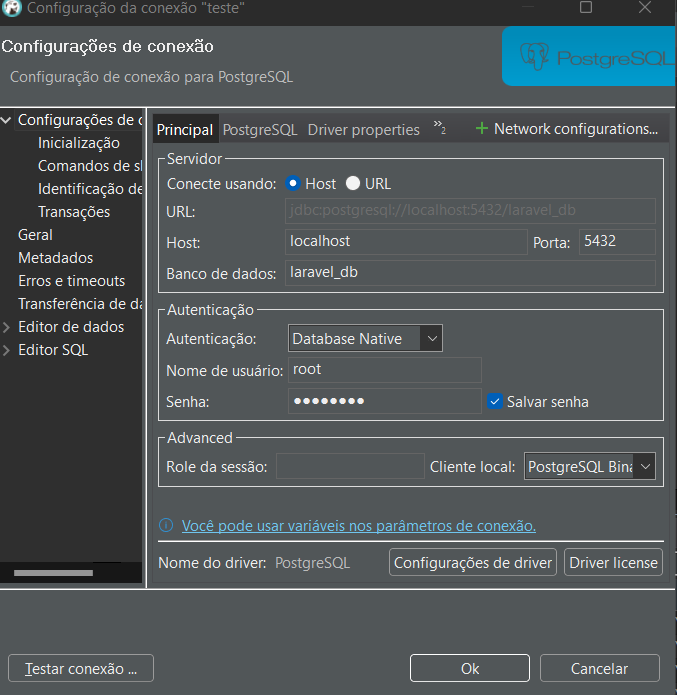
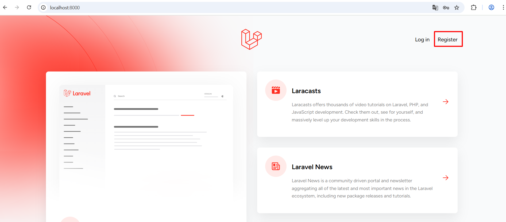
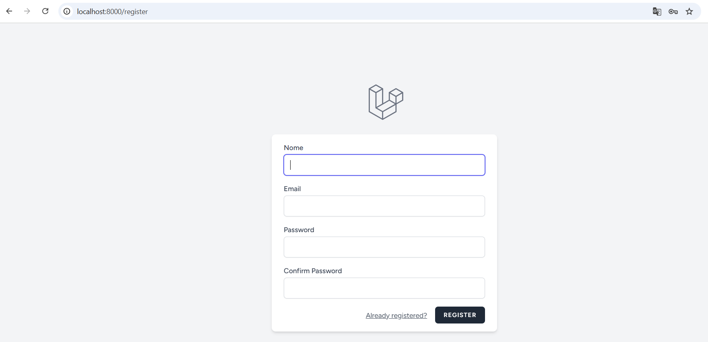
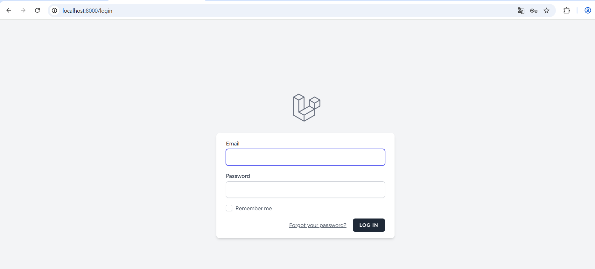
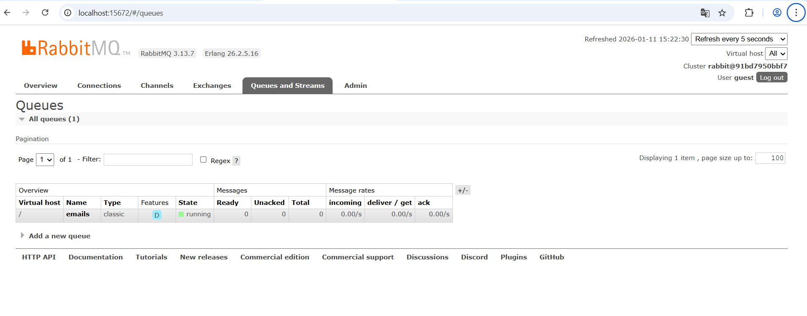
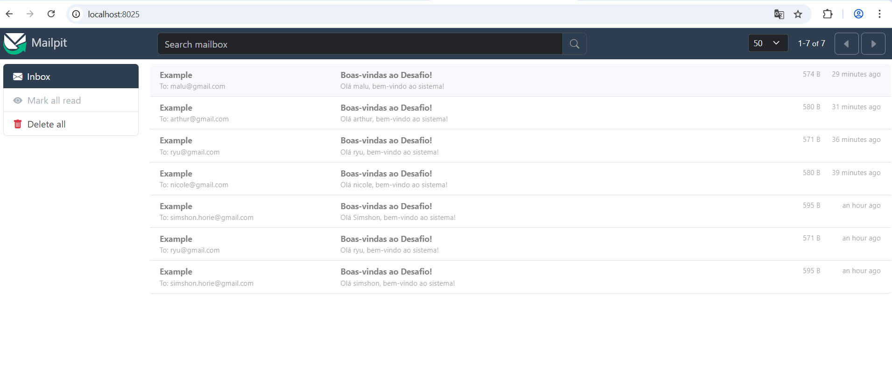
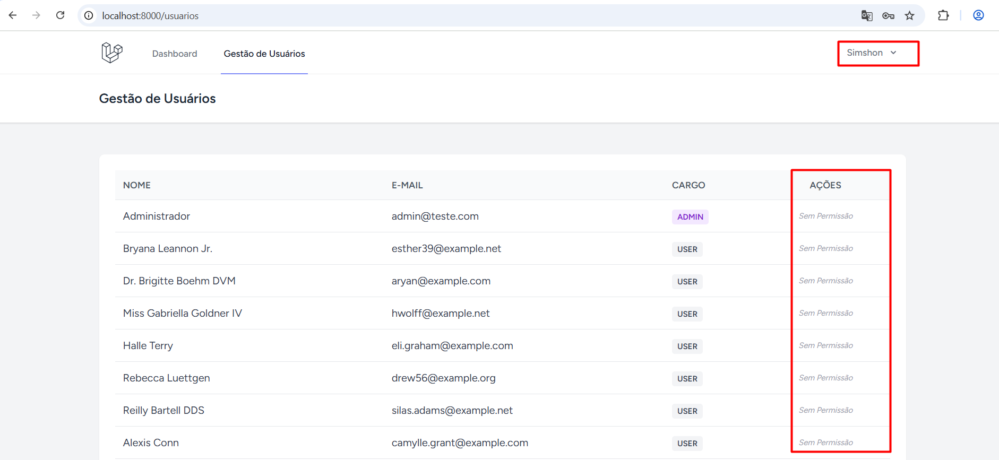
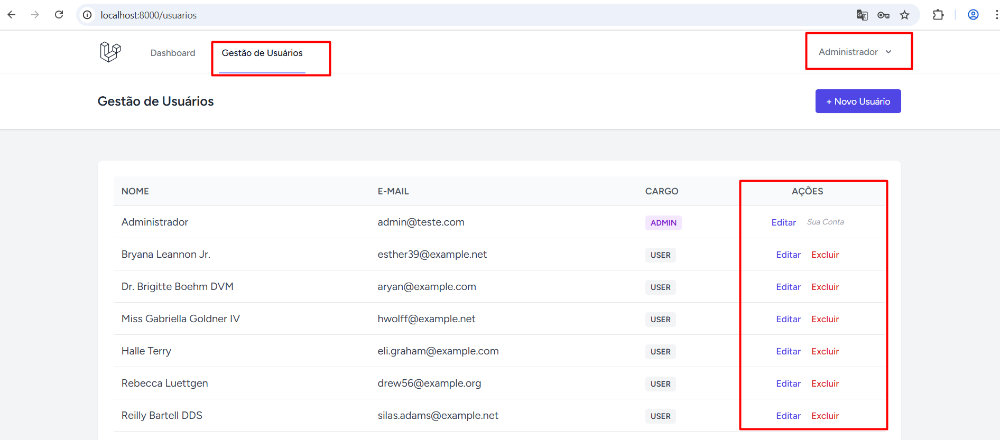

🛠 Tecnologias Utilizadas
Framework: Laravel 11 + Breeze (Autenticação)

Frontend: Vue.js 3 via Inertia.js (SSR & SPA Experience)

Estilização: Tailwind CSS

Banco de Dados: PostgreSQL 15 (Persistência e SoftDeletes)

Cache: Redis (Cache de perfis de usuários)

Mensageria: RabbitMQ (Processamento de filas para e-mails)

Ambiente: Docker & Docker Compose

Ferramentas de Teste: Mailpit (Captura de e-mails via SMTP local)

⚙️ Passo a Passo para Instalação
Siga os comandos abaixo para subir o ambiente do zero:

1. Clonar e Configurar
   
git clone https://github.com/SimshonHorie/api-cadastro-usuarios-completo.git

cd api-cadastro-usuarios-completo

cp .env.example .env

2. Subir o Ambiente Docker
   
Este comando irá construir as imagens e subir todos os serviços (App, Banco, Redis, RabbitMQ, Mailpit e Worker):

docker compose up -d --build

3. Instalar Dependências e Gerar Chave
   
docker compose exec app composer install

docker compose exec app npm install

docker compose exec app npm run build

docker compose exec app php artisan key:generate

4. Migrações e Dados de Teste (Seeder)
   
O comando abaixo limpa o banco e cria usuários automáticos via Factories, incluindo um Administrador:

docker compose exec app php artisan migrate:fresh --seed

🔑 Acessos e Ferramentas

Aplicação: http://localhost:8000

Mailpit (Ver E-mails de Boas-vindas): http://localhost:8025

RabbitMQ Dashboard: http://localhost:15672 (user: guest | pass: guest)

Credenciais de Teste da aplicação:

Admin: admin@teste.com | Senha: password

Usuarios Criados: (email criado) | (senha criada)

💡 Fluxos Implementados

📩 Envio de E-mail (RabbitMQ):

Ao cadastrar um novo usuário (seja via registro público ou pelo painel do Admin), um Job chamado EnviarEmailBoasVindas é despachado para a fila do RabbitMQ. O container laravel_worker processa essa tarefa e o e-mail aparece instantaneamente no Mailpit.

⚡ Cache de Performance (Redis):

Os dados do usuário recém-criado são armazenados no Redis com um tempo de expiração (TTL) de 5 minutos, simulando um ambiente de alta disponibilidade onde evitamos consultas desnecessárias ao banco de dados para dados lidos frequentemente.

🛡️ Gestão de Sessão (Admin vs User):

O sistema detecta se quem está criando o usuário é um Administrador. Se for, a sessão do Admin é preservada, permitindo a criação de múltiplos usuários em sequência sem perder o login.

📂 Comandos Úteis de Debug

Monitorar Fila em tempo real:

docker compose logs -f queue-worker

Verificar dados no Redis:

docker compose exec redis redis-cli keys *

Acessar Banco via Terminal:

docker compose exec db psql -U root -d laravel_db

Mas pode conectar via Dbeaver com as seguintes informações:

1 - HOST (localhost)

2 - Banco de dados (laravel_db)

3 - Porta (5432)

4 - Nome de usuário (root)

5 - senha (password)

Instalar os drivers que pede e testar conexão

Mostrando um pouco das funcionalidades:

Ao cadastrar um usuário ele dispara a fila para o rabbit e chegará um email no mailpit:

Ao logar com um usuário normal, a pessoa consegue visualizar os cadastros, mas não consegue realizar alterações:

Agora caso for o cadastro do adm, ele consegue editar, excluir e adicionar um novo cadastro, mas não consegue se auto excluir, devido a segurança implementada:

